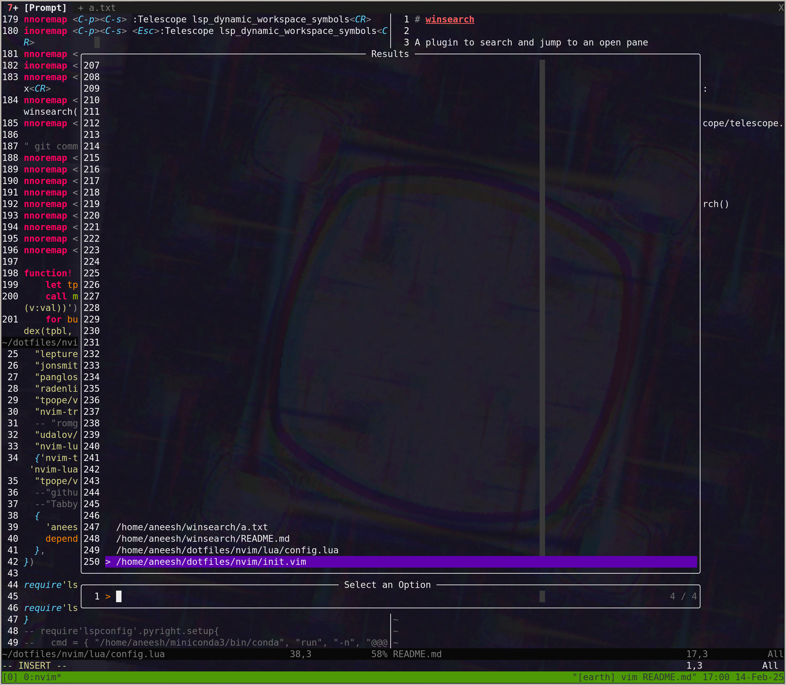

# winsearch

A plugin to search and jump to an open pane.

`winsearch` will search across all open panes, including panes that are in other
tabs, and will bring the selected pane into focus - without moving any of your
open panes or changing your splits!

## Installation/Usage

With [lazy.nvim](https://github.com/folke/lazy.nvimj):

```lua
{'aneeshdurg/winsearch', dependencies = { "nvim-telescope/telescope.nvim" }}
```

Once installed, you should be able to run:

```
:lua require("telescope").extensions.winsearch.winsearch()
```

It should bring up a window like the following:



See how in the example above `a.txt` is in a different tab. Selecting `a.txt`
would move focus to the appropriate tab.
